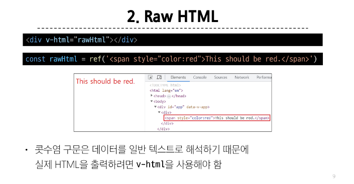
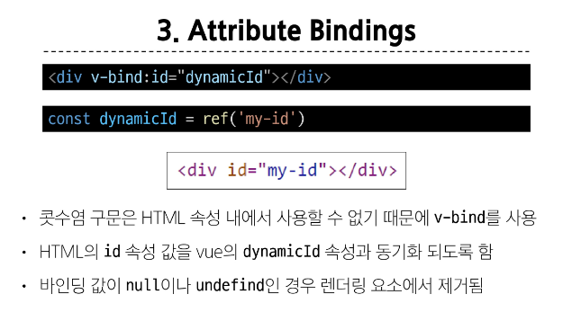
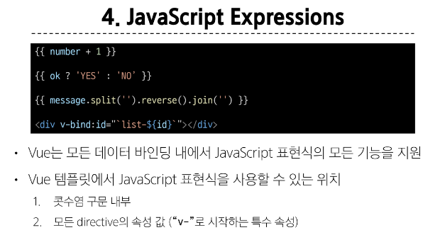
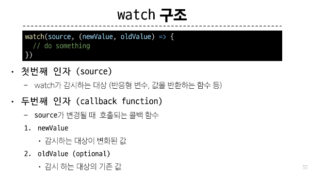
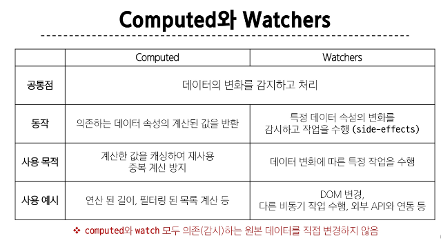

# Vue
- Vue 2문서 말구 Vue 3 문서로 들어가기


- Vue 기본 세팅
```
    const { createApp } = Vue

    const app = createApp ({
      setup() {
        const result = ~~~~
        result {
          result
        }
      }
    })

    app.mount('#app')
```

-  ref() : 반응형 상태를 선언하는 함수
  = reactive reference


***


***

```
 pip install django-environ
 <!-- settings.py에 설정 -->
import os
import environ

env = environ.Env(DEBUG=(bool, True))
environ.Env.read_env(env_file=os.path.join(BASE_DIR, '.env'))
API_KEY = env('API_KEY')
<!-- 그 전에 .env 파일은 만들자 -->
```
 1. API_KEY는 환경변수로 해

***





***



1. v-for 에 key 작성학
2. 동일 요소에 v-if v-for 사용 X


***
### Vue Project 생성
```
npm create vue@latest

cd vue-project
npm install
npm run dev
```
- npm install 했더니 lock.json, nodemodules 파일이 추가
- 