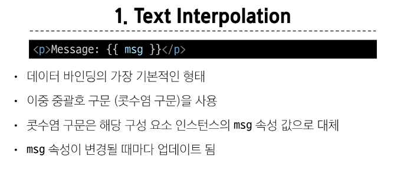
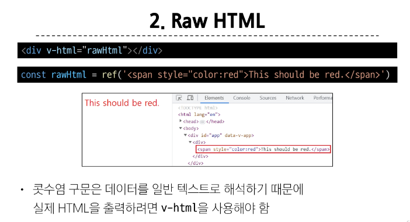
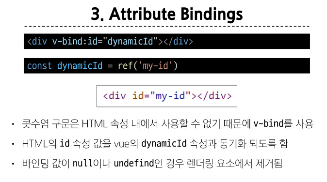
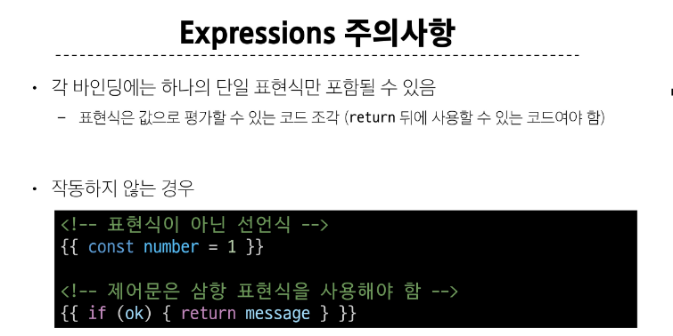
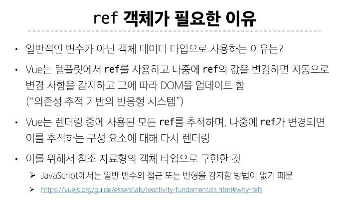

# Vue
- Vue 2문서 말구 Vue 3 문서로 들어가기

- Vue 기본 세팅
```
    const { createApp } = Vue

    const app = createApp ({
      setup() {
        const result = ~~~~
        result {
          result
        }
      }
    })

    app.mount('#app')
```

-  ref() : 반응형 상태를 선언하는 함수
  = reactive reference






***


