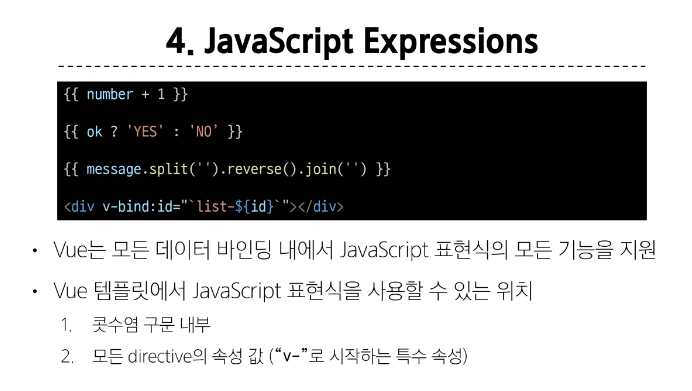

# Vue
- Vue 2문서 말구 Vue 3 문서로 들어가기
- vue 과평 start


- Vue 기본 세팅
```
    const { createApp } = Vue

    const app = createApp ({
      setup() {
        const result = ~~~~
        result {
          result
        }
      }
    })

    app.mount('#app')
```

-  ref() : 반응형 상태를 선언하는 함수
  = reactive reference





***


***

```
 pip install django-environ
 <!-- settings.py에 설정 -->
import os
import environ

env = environ.Env(DEBUG=(bool, True))
environ.Env.read_env(env_file=os.path.join(BASE_DIR, '.env'))
API_KEY = env('API_KEY')
<!-- 그 전에 .env 파일은 만들자 -->
```
 1. API_KEY는 환경변수로 해

***


***


1. v-for 에 key 작성학
2. 동일 요소에 v-if v-for 사용 X


***
### Vue Project 생성
```
npm create vue@latest

cd vue-project
npm install
npm run dev
```
- npm install 했더니 package-lock.json, node_modules 파일이 추가
- node_moduels => 
  - Node.js에 사용되는 외부 패키지가 저장되는 디렉토리
  - 프로젝트 의존성 모듈 저장 및 관리
  - .gitignore에 작성됨
- package-lock.json => 
  - 패키지 설치에 필요한 모든 정보 포함
  - 프로젝트 의존성을 관리하고 버전 충돌 및 일관성 유지
- public 디렉토리
  - 주로 정적 파일 위치 (import 할 필요 없는)
  - 항상 root 절대 경로를 참조 (/icon.png)
- src 디렉토리
  - 프로젝트 주요 소스 코드 포함
  - 컴포넌트, 스타일, 라우팅 등 핵심코드 관리
  - 1. assets = 프로젝트 내에서 사용되는 자원, 내부 파일 저장
  - 2. components = Vue 컴포넌트들 작성
  - 3. App.vue = 최상위 Root 컴포넌트
  - 4. main.js = 필요한 라이브러리 import, 전역 설정 수행
  - 5. index.html = Root 컴포너트 App.vue가 해당 페이지에 마운트
  ```
  import MyComponent from '@/components/MyComponent.vue' 
  <!-- @ = src를 뜻하는 약어 -->
  ```

  ***
  
  

  ***

### pinia-plugin-persistedstate
  - 웹 애플리케이션 상태를 브라우저의 local storage나 session storage에 영구적으로 저장하고 복원하는 기능을 제공 
  ```
  npm i pinia-plugin-persistedstate

    
  import { createApp } from 'vue'
  import { createPinia } from 'pinia'
  import App from './App.vue'

  import { createPinia } from 'pinia'
  import piniaPluginPersistedstate from 'pinia-plugin-persistedstate'


  const pinia = createPinia()
  const app = createApp(App)

  pinia.use(piniaPluginPersistedstate)
  // app.use(createPinia())
  app.use(pinia)

  app.mount('#app')

  <!-- count.js에 -->
  <!-- pinia 반드시 반환값 필요  -->
  return { todos, addTodo, deleteTodo, updateTodo, doneTodosCount }
  }, {persist: true})
  <!-- persist: true 써주기 -->

  ```

